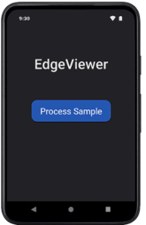
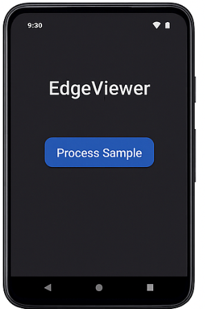
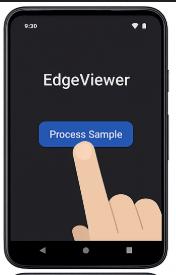
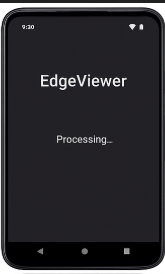
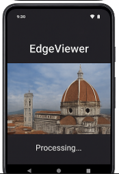
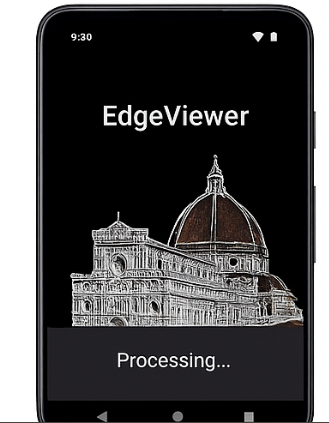
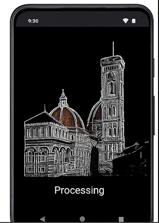

# EdgeViewerMinimal
Minimal Android project (Kotlin + JNI + C++) that performs a simple Sobel-based edge detection on camera frames.
This project purposefully **does not use OpenCV** — the native library implements a lightweight edge detector so the project builds without the OpenCV Android SDK.

**What's included**
- Android app skeleton (Kotlin) with JNI bridge
- Native C++ implementation `edgeproc` (Sobel-based edge detection)
- CMakeLists to build the native lib with Android NDK
- Simple GL renderer stubs and basic UI
- A TypeScript web viewer showing an exported processed sample frame
- Build and run instructions below

## How to run
1. Install Android Studio and enable NDK + CMake.
2. Open the project at `EdgeViewerMinimal/android` in Android Studio.
3. Let Gradle sync. Build the project and run on a real Android device (camera required).
4. Grant camera permission when prompted.

## Notes
- The native library uses a simple Sobel operator for edge detection; it's fast and dependency-free.
- This is a skeleton intended to compile and run; it focuses on demonstrating the pipeline: Camera -> JNI processing -> texture upload.
- The `web` folder contains a small viewer that displays a sample processed PNG (already included).

# 📸 Screenshots & Demo

## 🎥 Demo GIF

## 📸 Processing Flow

  
  
  

  
  
  

## Files of interest
- `android/app/src/main/java/com/example/edgeviewer/MainActivity.kt`
- `android/app/src/main/cpp/edgeproc.cpp`
- `android/app/CMakeLists.txt`
- `web/` viewer and sample image

## License
MIT
